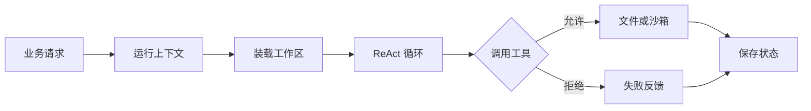

# AgentScope AbstractFilesystem 工程实践：Workspace 路由与沙箱隔离


AgentScope 的 Workspace 是逻辑目录，AbstractFilesystem 才决定文件真正落在哪里。工程关键是让本地模板、共享存储、租户命名空间与沙箱执行遵循同一套路由规则，避免多副本续跑时出现状态断片或数据串租。

可以把 **Harness** 理解成一张“移动木工台”。`ReActAgent` 是负责判断下一刀怎么切的木匠，Harness 则提供图纸柜、可换底盘、检查卡扣和防护罩。没有它，木匠也能完成一次加工；有了它，同一套工艺才能跨会话继续、在多实例间接力，并把危险工具关进隔离区。

> 版本说明：内容按 AgentScope Java `2.0.1` 官方仓库与 2.0 文档核对，核对日期为 2026-08-27。1.1 时代以 Hook 为主的示例不能直接套用到 2.0；2.0 的核心扩展链路已经统一到 Middleware、Toolkit、AgentState 与 RuntimeContext 等契约。

## 一、先分清逻辑目录与物理存储

### 1、Harness 只提供问题发生的背景

**ReAct**（Reasoning and Acting）负责模型推理、选择工具、消费工具结果，再决定继续还是结束。它解决的是单次执行循环。

**HarnessAgent** 复用这套推理内核，并在外层补齐长时间运行所需的工程能力：

| 层次 | 主要职责 | 典型组件 |
| --- | --- | --- |
| 推理内核 | 推理、工具调用、生成响应 | `ReActAgent` |
| 执行拦截 | 注入上下文、压缩、持久化、权限检查 | Middleware |
| 工具表面 | 文件、记忆、Skill、SubAgent 等能力 | Toolkit |
| 持久资产 | 人设、知识、记忆、任务与会话日志 | Workspace |
| 运行状态 | 支持一次会话中断后恢复 | AgentState |
| 隔离设施 | 限制文件范围和命令执行环境 | AbstractFilesystem、Sandbox |

**关键区别：Harness 不替模型做决策，而是约束决策发生在哪里、能够读写什么、状态如何延续。**

### 2、一次调用经过哪些边界

图意：业务请求先获得租户身份，再装载工作区上下文，进入 ReAct 循环；工具执行必须经过权限与隔离边界，最后同时写回运行状态和长期资产。



这条链路把“模型决定做什么”与“系统允许怎么做”分开。生产环境最重要的不是让模型永远判断正确，而是让错误判断也无法越过系统边界。

## 二、Workspace 是智能体的事实来源

### 1、同一棵目录承载三种生命周期

**Workspace**（工作区）是智能体定义与持续演进的事实来源。它不是简单的聊天记录目录，至少要区分三类内容：

| 生命周期 | 内容示例 | 维护者 | 用途 |
| --- | --- | --- | --- |
| 静态资产 | `AGENTS.md`、`knowledge/`、`skills/`、`subagents/`、`tools.json` | 工程团队 | 定义身份、知识和能力 |
| 运行文件 | 会话日志、任务记录、计划文件 | 框架与 Agent | 支持审计和后续继续 |
| 长期记忆 | `MEMORY.md`、按日期沉淀的记忆文件 | Agent 与后台任务 | 跨会话复用稳定事实 |


原图来自 AgentScope Java 1.1 Harness 介绍，图中的核心关系在 2.0 仍成立：`AGENTS.md`、记忆、知识和 Skill 都围绕 Workspace 组织；具体注入链路应以 2.0 的 Middleware 契约为准。

目录放在一起便于版本化、部署和迁移，但读取策略并不相同。`AGENTS.md` 会进入每轮系统上下文；知识目录通常只注入入口与文件清单，需要时再读取；运行中的可恢复快照则交给独立的 `AgentStateStore`。

### 2、Workspace 不等于 AgentState

这个边界很容易混淆：

- Workspace 保存可阅读、可审计、可长期积累的文件资产。
- **AgentState** 保存当前对话缓冲、滚动摘要、权限状态、工具状态等恢复快照。

把二者混成一份数据会产生两个问题：长期资产被高频覆盖，或者恢复状态被当成知识错误注入提示词。正确做法是分别设计保留周期、备份方式和访问权限。

### 3、每轮重新装载意味着配置可热更新

AgentScope 2.0 的 `WorkspaceContextMiddleware` 会在每轮推理前重新组装工作区上下文。修改 `AGENTS.md` 或 `MEMORY.md` 后，下一次调用即可看到变化，不必重建 Agent。

这也带来治理要求：

- `AGENTS.md` 应进入代码审查，避免线上行为被静默改写。
- `MEMORY.md` 需要容量上限和错误事实纠正机制。
- `knowledge/` 只暴露目录不代表安全，文件读取仍要经过权限与路径校验。
- 会话日志默认适合审计，不等于可以无限保留，必须配套归档与删除策略。

## 三、AbstractFilesystem 才是核心路由层

### 1、一套工具面对不同后端

**AbstractFilesystem**（抽象文件系统）统一提供 `ls`、`read`、`write`、`edit`、`grep`、`glob`、上传与下载等文件能力。上层 Middleware 和工具只依赖抽象接口，不需要知道文件最终落在本机磁盘、共享存储还是沙箱。

这种设计类似给移动木工台安装可换底盘：桌面工序不变，底部可以换成本地轮子、共享轨道或封闭作业舱。

| 模式 | 适用场景 | 主要边界 |
| --- | --- | --- |
| 本地文件系统 | 单机开发、可信内部任务 | 数据绑定单机，Shell 权限必须单独控制 |
| 共享或远程文件系统 | 多副本服务、跨实例续跑 | 依赖命名空间隔离与一致性策略 |
| 沙箱文件系统 | 不可信代码、外部文件处理 | 文件和进程在隔离环境执行，可做快照恢复 |


原图保留了 Harness 1.1 对统一文件能力入口的表达。2.0 中组件名称和扩展链路已有调整，但“上层能力不直接绑定本机磁盘”仍是理解 AbstractFilesystem 的关键。

### 2、双层读取兼顾模板与运行时覆盖

官方 Workspace 契约采用“文件系统优先、本地模板兜底”的双层读取：

```text
读取 AGENTS.md
  ├─ 抽象文件系统中存在：读取运行时覆盖版本
  └─ 不存在：读取镜像或项目内的本地模板

写入 Workspace
  └─ 始终写入抽象文件系统
```

这对多实例很实用：容器镜像携带默认模板，共享存储保存线上覆盖内容。新实例启动时先能工作，管理员更新共享版本后，各实例在下一轮调用读取同一份事实来源。

**注意：双层读取不是最终一致性的替代品。** 多实例同时修改同一记忆文件时，仍需依赖存储端的版本号、条件写入或串行化策略，避免后写覆盖前写。

## 四、RuntimeContext 是多租户路由键

### 1、身份必须随调用传入

AgentScope 2.0 要求调用 `HarnessAgent` 时传入 **RuntimeContext**（运行上下文）。其中 `sessionId` 区分会话，`userId` 可参与用户级隔离。隔离信息会继续影响工作区路径、远程存储命名空间、状态存储和沙箱槽位。

下面是按官方 2.0.1 快速开始契约精简的最小示例：

```xml
<dependency>
    <groupId>io.agentscope</groupId>
    <artifactId>agentscope-harness</artifactId>
    <version>2.0.1</version>
</dependency>

<dependency>
    <groupId>io.agentscope</groupId>
    <artifactId>agentscope-extensions-model-dashscope</artifactId>
    <version>2.0.1</version>
</dependency>
```

```java
import io.agentscope.core.agent.RuntimeContext;
import io.agentscope.core.message.UserMessage;
import io.agentscope.harness.agent.HarnessAgent;

import java.nio.file.Paths;

public class CustomerSupportAgent {

    public static void main(String[] args) {
        HarnessAgent agent = HarnessAgent.builder()
                .name("customer-support")
                .sysPrompt("处理售后问题，涉及退款时只整理依据，不直接执行退款。")
                // 模型注册器会从环境变量读取对应凭证，禁止把密钥写进代码。
                .model("dashscope:qwen-plus")
                .workspace(Paths.get(".agentscope/workspace"))
                .build();

        RuntimeContext context = RuntimeContext.builder()
                // 业务侧必须传入已鉴权的真实标识，不能信任模型生成的租户 ID。
                .userId("user-10086")
                .sessionId("ticket-20260827-001")
                .build();

        agent.call(
                new UserMessage("整理订单退款条件，并列出缺失材料。"),
                context
        ).block();
    }
}
```

### 2、不要让模型决定租户身份

`userId` 和 `sessionId` 应来自登录态、网关令牌或服务端业务上下文。以下做法都不安全：

- 从用户自然语言里提取 `userId`。
- 允许工具参数覆盖当前租户。
- 多个用户共用固定 `sessionId`。
- 只在数据库查询时加租户条件，却让文件、记忆和沙箱共用命名空间。

**隔离必须端到端一致。** 任意一层漏传上下文，都可能让正确的文件系统抽象落到错误的数据桶。

## 五、沙箱隔离的是副作用，不是提示词

### 1、文件工具与 Shell 不是同一种能力

能读取工作区文件，不代表必须开放命令执行。文件工具可以限制在抽象路径和固定操作集合内；Shell 则可能启动进程、访问网络、消耗资源或绕过上层工具契约。

因此，生产配置应把能力拆开：

- 只需读写业务文件：开放受控文件工具，不开放 Shell。
- 需要执行不可信代码：放入独立沙箱，限制 CPU、内存、时间、网络和挂载目录。
- 涉及付款、删除、发信等外部副作用：继续经过权限引擎与人工审批，不能因为进了沙箱就自动放行。

### 2、沙箱不是完整安全方案

沙箱可以缩小主机受损范围，但无法判断业务动作是否合理。例如删除沙箱里的临时文件风险较低，调用真实退款接口即使在沙箱中执行，业务损失仍然存在。

生产边界至少包含四层：

1. **参数校验**：Schema、长度、枚举值和资源归属都由服务端校验。
2. **权限决策**：工具按允许、需审批、拒绝分级。
3. **执行隔离**：危险文件和进程操作进入沙箱。
4. **审计追踪**：记录租户、会话、工具、参数摘要、结果和耗时。

## 六、落地时先做四个取舍

### 1、选择 ReActAgent 还是 HarnessAgent

一次性问答、无持久状态、工具很少时，`ReActAgent` 更轻。出现跨会话记忆、工作区资产、分布式恢复、SubAgent 或沙箱需求时，再使用 `HarnessAgent`。

### 2、定义 Workspace 的所有权

静态资产由工程团队管理，运行文件由框架管理，长期记忆由 Agent 生成但必须可审计。不要让所有目录都对模型开放任意写权限。

### 3、确定隔离粒度

先回答哪些内容按组织共享、哪些按用户隔离、哪些仅在会话内有效，再设置命名空间。隔离粒度过粗会串数据，过细则无法复用知识并放大存储成本。

### 4、把失败当成正常路径

文件写入冲突、状态保存失败、沙箱创建超时、工具被拒绝都应返回结构化结果。模型可以解释失败并调整计划，但不能吞掉错误后假装任务已经完成。

建议至少观测以下指标：

| 指标 | 作用 |
| --- | --- |
| 每轮上下文 Token 数 | 发现工作区注入或工具结果膨胀 |
| 状态恢复成功率 | 判断跨实例续跑是否可靠 |
| 文件读写延迟与冲突数 | 定位共享存储瓶颈 |
| 沙箱创建与执行耗时 | 区分模型慢和环境慢 |
| 工具允许、审批、拒绝数量 | 发现权限策略漂移 |
| 租户维度错误率 | 排查特定命名空间或数据问题 |

## 七、总结

Workspace 说明要读写哪份资产，AbstractFilesystem 决定资产落在哪里，RuntimeContext 与 Sandbox 决定谁能在什么边界内操作它。

**要点回顾**：Workspace 只定义逻辑文件树，AbstractFilesystem 决定物理落点；Workspace 保存可审计资产，AgentState 保存可恢复运行状态；RuntimeContext 把用户和会话身份贯穿到状态、文件与沙箱；沙箱限制执行副作用，权限与审批继续约束业务副作用。

**关联知识点**：Agent 上下文工程决定哪些 Workspace 内容进入本轮提示词，以及何时压缩或卸载大结果；Agent 分层记忆区分当前对话、长期事实与原始会话日志的生命周期；Agent Skills 将可复用操作说明按需加载到 Workspace；SubAgent 委派通过独立角色拆分复杂任务并回收状态；HITL 审批为高风险工具增加人工决策节点。

**面试常问**：HarnessAgent 会替代 ReActAgent 吗？→ 不会，它是在 ReAct 推理内核外叠加工程能力；Workspace 与 AgentState 有什么区别？→ 前者保存长期可阅读资产，后者保存可恢复运行快照；有了沙箱为什么还要权限控制？→ 沙箱限制主机级副作用，权限控制限制业务级副作用，两者不能互相替代。

**参考资料**：[AgentScope Java 2.0 快速开始](https://java.agentscope.io/v2/en/docs/quickstart.html)、[Harness 架构](https://java.agentscope.io/v2/en/docs/harness/architecture.html)、[Workspace](https://java.agentscope.io/v2/en/docs/harness/workspace.html)、[文件系统](https://java.agentscope.io/v2/en/docs/harness/filesystem.html)、[沙箱](https://java.agentscope.io/v2/en/docs/harness/sandbox.html)、[AgentScope Java 官方仓库](https://github.com/agentscope-ai/agentscope-java)。