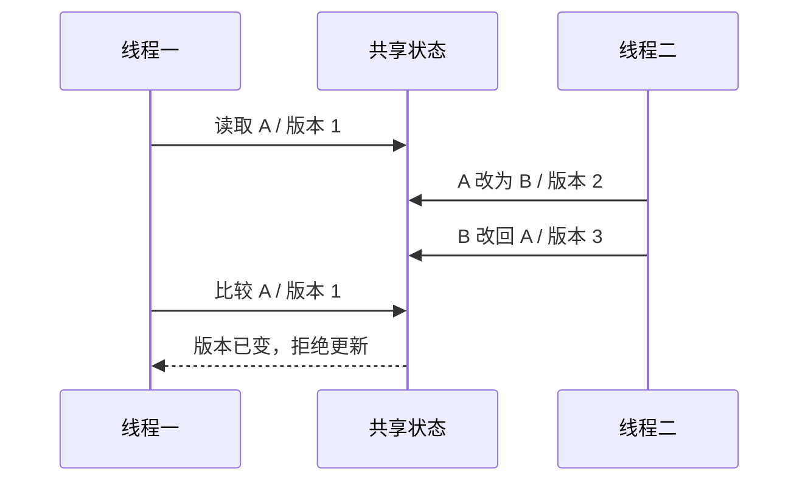

# Java CAS 工程实践：原子更新、ABA 与竞争退化


CAS 只在“当前值仍等于预期值”时完成原子替换；正确使用还要处理重试、副作用、ABA、内存语义与高竞争退化，必要时改用版本戳、分段计数或锁。

## 先说结论：CAS 是条件更新，不是万能无锁

**比较并设置**（Compare-And-Set，CAS）接收当前变量、预期值和新值。只有当前值仍等于预期值时，替换才成功；否则返回失败，由调用方重新读取、计算或放弃。

CAS 适合一个变量就能表达完整状态的短操作，例如序号、自增计数、状态位和不可变对象引用。它不自动解决三个问题：

- 多个变量之间的业务不变量；
- 值从 A 变成 B 又回到 A 的 **ABA 问题**；
- 大量线程反复失败时的 CPU 消耗与尾延迟。

以下内容以 Java SE **25** 的 `java.util.concurrent.atomic` 与 `VarHandle` 公开 API 为基线，事实核对日期为 **2026-08-31**。底层指令和缓存一致性实现取决于 JVM 与处理器，业务代码不应假设 CAS 必然“锁总线”或“禁止中断”。

## 一、一次 CAS 到底保证什么

下面是一段受限扣减：库存足够才减一，竞争失败就基于新值重算。

```java
import java.util.concurrent.atomic.AtomicInteger;

public final class LocalQuota {
    private final AtomicInteger remaining;

    public LocalQuota(int initial) {
        this.remaining = new AtomicInteger(initial);
    }

    public boolean tryAcquire() {
        while (true) {
            int current = remaining.get();
            if (current == 0) {
                return false;
            }
            // 只有库存未被其他线程改变时才扣减成功。
            if (remaining.compareAndSet(current, current - 1)) {
                return true;
            }
            // 失败说明观察值已过期，重新读取后再判断。
        }
    }
}
```

这段循环存在明确的**线性化点**（Linearization Point）：成功的 `compareAndSet`。对外看，扣减像在这个瞬间完成。失败的线程没有修改状态，只能重新竞争。

CAS 保证的是这次读改写不可被拆开观察，不代表整个方法都成为事务。若扣减后还要写订单、发消息或调用支付接口，仍需数据库事务、幂等键、Outbox 或补偿机制。

## 二、Java 原子更新 API 怎么选

Java 25 的原子能力可以按状态形态分为五组：

| 形态 | 代表 API | 适用场景 | 关键边界 |
| --- | --- | --- | --- |
| 单值 | `AtomicBoolean`、`AtomicInteger`、`AtomicLong`、`AtomicReference` | 状态位、序号、单对象快照 | 只能原子维护一个值 |
| 数组元素 | `AtomicIntegerArray`、`AtomicLongArray`、`AtomicReferenceArray` | 固定槽位独立更新 | 不保证多个元素整体原子 |
| 对象字段 | 三类 `Atomic*FieldUpdater`、`VarHandle` | 节点字段、低额外对象开销 | 访问权限、字段类型和内存模式要匹配 |
| 带附加状态的引用 | `AtomicStampedReference`、`AtomicMarkableReference` | 版本检测、逻辑删除 | 版本或标记必须参与同一次比较 |
| 分散累加 | `LongAdder`、`DoubleAdder`、`LongAccumulator`、`DoubleAccumulator` | 高并发指标与统计 | 聚合读取不是并发更新时的原子快照 |

常用更新方法也有不同返回契约：

- `compareAndSet` 返回是否替换成功；
- `compareAndExchange` 返回见证值，省去失败后再读一次；
- `getAndSet`、`getAndAdd` 返回旧值；
- `updateAndGet`、`accumulateAndGet` 接收函数并返回新值；
- `weakCompareAndSet*` 允许**伪失败**，只适合本来就在循环重试且清楚内存模式的底层代码。

业务代码优先使用语义直接的高层方法。只有需要自定义条件、返回失败时的真实值或精细内存顺序时，才下沉到 CAS、`compareAndExchange` 或 `VarHandle`。

## 三、重试函数必须无副作用

`updateAndGet` 的函数可能因竞争失败被重复执行。把外部副作用写进函数，会出现“状态只更新一次，副作用执行多次”。

```java
AtomicInteger balance = new AtomicInteger(10);

int updated = balance.updateAndGet(current -> {
    // 只做纯计算；这里不能发送消息、写数据库或扣第三方余额。
    return Math.max(0, current - 1);
});
```

正确边界是先用纯函数完成状态竞争，成功后再以幂等方式执行外部动作。若外部动作和状态必须同成同败，CAS 循环就不是正确抽象，应回到事务或状态机。

另一个常见错误是无限空转。非关键快路径可以设置有限尝试次数，失败后进入锁、队列或返回繁忙；不要在高竞争请求线程里无界占用 CPU。

```java
public boolean tryUpdateWithBudget(AtomicInteger state, int next) {
    for (int attempt = 0; attempt < 8; attempt++) {
        int observed = state.get();
        if (state.compareAndSet(observed, next)) {
            return true;
        }
        Thread.onSpinWait(); // 提示当前处于短暂自旋，不提供公平性保证。
    }
    return false;
}
```

## 四、ABA：值相同，不代表没发生过变化

线程 T1 读取引用 A 后暂停；线程 T2 把 A 改成 B，又改回同一个 A。T1 再做 CAS 时仍可能成功，但中间变化已经发生。对只关心最终数值的计数器，ABA 未必有害；对无锁栈节点复用、对象池和状态迁移，它可能破坏结构不变量。



`AtomicStampedReference` 把引用和整数版本戳作为一对原子更新：

```java
import java.util.concurrent.atomic.AtomicStampedReference;

AtomicStampedReference<String> state =
        new AtomicStampedReference<>("READY", 1);

int[] stampHolder = new int[1];
String observed = state.get(stampHolder);
int observedStamp = stampHolder[0];

boolean changed = state.compareAndSet(
        observed,
        "RUNNING",
        observedStamp,
        observedStamp + 1); // 引用与版本必须同时匹配。
```

若只需表达“是否已逻辑删除”，可使用 `AtomicMarkableReference` 的布尔标记。版本戳也不是无限历史：`int` 会回绕，且对象复用策略仍要设计。复杂无锁内存回收通常需要更专门的算法，不能只加一个版本号就宣告安全。

## 五、原子性之外还有内存语义

`VarHandle` 把访问模式分为 Plain、Opaque、Acquire/Release 和 Volatile。强度越高，可禁止的重排序越多，使用条件也越严格。

| 模式 | 直观含义 | 典型用途 |
| --- | --- | --- |
| Plain | 普通字段访问语义 | 单线程或已有同步保护 |
| Opaque | 同一变量保持一致观察，排序约束较弱 | 少量底层算法 |
| Acquire / Release | 发布之前的写对获取之后的读可见 | 单向发布协议 |
| Volatile | volatile 读写语义并参与全序 | 通用跨线程状态同步 |

`VarHandle.compareAndSet` 成功更新具有 volatile 读写语义；`compareAndExchangeAcquire/Release` 和 `weakCompareAndSetAcquire/Release` 则提供定向约束。**不要为了微小性能差异随意降级内存模式。** 没有完整证明时，优先使用原子类默认方法或 volatile 语义。

还要区分“原子引用”和“对象内容原子”。`AtomicReference<OrderState>` 只能保证引用替换；若多个线程继续修改同一个 `OrderState` 实例内部字段，数据竞争仍然存在。更稳妥的方式是使用不可变状态，每次构造新快照后替换引用。

## 六、高竞争时为什么会退化

CAS 不阻塞线程，但失败重试仍有成本：重新读取、重新计算、缓存行争用和流水线停顿。线程越多，单一热点变量越容易形成“所有人同时抢一个门把手”的局面。

工程上按目标选择：

- 精确序号、余额或状态迁移：`AtomicLong`、`AtomicReference` 或锁，读取必须精确；
- 高频指标累加：`LongAdder`，用额外空间分散写竞争，接受 `sum()` 不是并发瞬间的原子快照；
- 多字段一致更新：把字段封装进不可变对象后原子替换，或直接使用锁；
- 写入包含 I/O、阻塞或复杂计算：使用锁、队列、Actor 或事务，不让 CAS 循环重复重活；
- 需要公平、超时或可中断等待：使用 `Lock`、`Semaphore` 等同步器。

“无锁”描述的是进展性质，不等于无硬件同步、零等待或低延迟。Java 原子包提供单变量的 lock-free 更新工具，但具体算法是否 lock-free，要看完整循环、失败路径和内存回收设计。

## 七、排障与观测看什么

CAS 热点不会像锁竞争那样直接表现为大量 `BLOCKED` 线程。更有效的信号是：

- 每次成功更新前的失败次数与重试分布；
- 尝试耗时的 P95/P99，而不只看平均值；
- 热点 key、分片或状态对象，但避免高基数标签；
- CPU 占用上升时吞吐是否停止增长；
- 降级到锁、队列或拒绝更新的次数。

监控代码不要反过来放大竞争。失败计数可使用 `LongAdder`，采样记录热点，不要在每次失败时同步打印日志。

## 八、总结

**要点回顾：** CAS 是“观察—计算—条件替换”协议；失败必须重读，更新函数必须无副作用；ABA 需要版本或标记参与比较；原子更新还要匹配正确的内存语义；热点竞争下应考虑分散、退避或换回锁。

**一句话结论：CAS 最适合短小、单状态、可重算的更新；一旦状态跨字段、副作用不可重复或竞争长期激烈，就该换抽象。**

**关联知识点：** AQS 使用 CAS 管理同步状态并在失败后排队；`volatile` 提供可见性与有序性但不自动合并复合操作；不可变对象可把多字段快照压缩成一次引用替换；`LongAdder` 通过分散写入降低热点计数竞争。

**面试常问：** CAS 为什么会失败？当前值与预期值不同，弱 CAS 还可能伪失败。ABA 一定有问题吗？只有中间历史会影响正确性时才需要处理。`LongAdder` 为什么更适合指标？它用多个变量分散竞争，但聚合值不适合作为强一致业务判断。

**参考资料：** [Java SE 25 原子包](https://docs.oracle.com/en/java/javase/25/docs/api/java.base/java/util/concurrent/atomic/package-summary.html)；[Java SE 25 AtomicInteger](https://docs.oracle.com/en/java/javase/25/docs/api/java.base/java/util/concurrent/atomic/AtomicInteger.html)；[Java SE 25 AtomicStampedReference](https://docs.oracle.com/en/java/javase/25/docs/api/java.base/java/util/concurrent/atomic/AtomicStampedReference.html)；[Java SE 25 VarHandle](https://docs.oracle.com/en/java/javase/25/docs/api/java.base/java/lang/invoke/VarHandle.html)；[Java 语言规范：线程与锁](https://docs.oracle.com/javase/specs/jls/se25/html/jls-17.html)。
