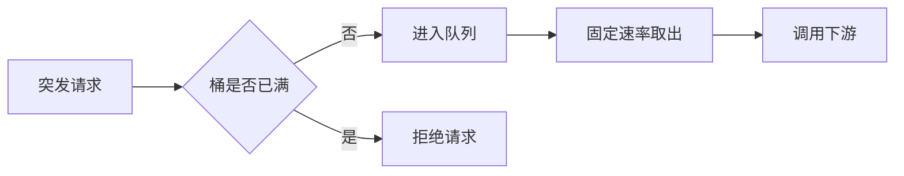

# Java 服务限流工程实践：固定窗口、滑动窗口、漏桶与令牌桶


限流不是简单地拒绝超额请求。固定窗口适合低成本配额，滑动窗口换取更平滑的统计，漏桶负责匀速整形，令牌桶允许受控突发；工程落地还要处理限流维度、集群一致性、失败策略与 429 响应契约。

## 一、先确定限制的到底是什么

**限流**（Rate Limiting）是在给定维度和时间范围内，限制请求或资源消耗速度。它保护的是数据库、第三方接口、支付通道、LLM 配额等稀缺能力，不是为了让监控曲线更好看。

一条可执行的限流规则至少包含五部分：

| 要素 | 需要回答的问题 | 示例 |
|---|---|---|
| 资源 | 保护哪个入口或下游 | 创建订单接口 |
| 维度 | 谁共享同一额度 | 租户 + 用户 + API |
| 计量 | 一次调用消耗多少 | 普通查询 1 个令牌，批量导出 10 个令牌 |
| 算法 | 如何计算是否超限 | 令牌桶 |
| 超限动作 | 拒绝、排队还是降级 | 返回 429，并给出重试时间 |

限流还要与三个概念分开：

- **并发隔离**（Concurrency Limiting）限制正在执行的任务数，保护线程、连接和内存。
- **配额**（Quota）限制较长周期内的总用量，例如每天 10 万次。
- **背压**（Backpressure）让上游根据下游消费能力主动减速。

只配置“每秒 100 次”却不说明按 IP、用户还是租户统计，规则实际上还没有设计完成。

## 二、四类算法的核心差异

| 算法 | 状态 | 突发能力 | 输出节奏 | 主要代价 |
|---|---|---|---|---|
| 固定窗口 | 当前窗口计数 | 窗口边界可能放大突发 | 不整形 | 精度最低、成本最低 |
| 滑动窗口 | 请求时间或分段计数 | 较准确约束任意时间段 | 不整形 | 内存与计算更高 |
| 漏桶 | 有界队列 + 固定流出速率 | 通常不鼓励突发 | 平滑、近似匀速 | 引入排队与等待 |
| 令牌桶 | 当前令牌 + 最近补充时间 | 桶容量内允许突发 | 平均速率受控 | 需要原子补充与扣减 |

### 1、固定窗口：便宜，但有边界突刺

**固定窗口计数器**（Fixed Window Counter）把时间切成互不重叠的区间，每个区间独立计数。限制为每分钟 100 次时，12:00:00 到 12:00:59 共用一个计数器，进入下一分钟后归零。

它的弱点是边界效应：前一个窗口最后 1 秒放行 100 次，下一个窗口第一秒又放行 100 次，两秒内可能通过 200 次。窗口总量没有超标，但瞬时压力翻倍。

固定窗口适合：

- 计费、日配额等天然按日历周期结算的场景；
- 能接受短时突刺、希望状态极简的低成本入口；
- 作为多层保护中的粗粒度外层，而不是数据库前的唯一防线。

Redis 官方给出的经典实现使用按时间窗口分桶的 `INCR` 与 `EXPIRE`。生产实现必须让计数和过期设置原子完成，避免进程在两条命令之间失败后留下永不过期的键。

### 2、滑动窗口：统计更准，但不是只有一种实现

**滑动窗口**（Sliding Window）统计“当前时刻向前一段时间”内的请求。常见实现有两种：

1. **滑动日志**（Sliding Log）：保存每次请求时间戳，先删除窗口外记录，再统计剩余数量。结果精确，但高基数、高流量下内存和清理成本较高。
2. **滑动窗口计数器**（Sliding Window Counter）：把大窗口切成多个小格，汇总覆盖范围内的格子；还可按当前窗口进度对相邻窗口加权。状态更小，但存在分段误差。

Redis Sorted Set 可实现滑动日志，但一次判定中的“删除旧记录、统计、写入新记录、设置过期时间”应放进 Lua 脚本，避免并发请求穿插后重复放行。

问：滑动窗口能彻底消除突发吗？

不能。它限制任意窗口内的总量，但仍可能在一个很短的时间片集中放行。若下游要求稳定消费速度，应使用漏桶或再叠加并发隔离。

### 3、漏桶：用排队换平滑

**漏桶**（Leaky Bucket）把请求放入容量有限的队列，再按固定速率流出。队列满后，新请求被拒绝或丢弃。RFC 3290 将漏桶主要用于流量整形：目标是让输出尽量接近恒定速率。



漏桶适合写入带宽固定、下游只能匀速处理的任务，例如短信通道或批处理网关。代价是排队延迟：如果请求在队列中等待的时间已经超过业务超时，继续排队只会制造“过期工作”。因此必须同时设置队列容量、排队超时和取消传播。

### 4、令牌桶：平均受控，同时保留突发能力

**令牌桶**（Token Bucket）按速率 `r` 生成令牌，最多存到容量 `b`。请求消耗相应数量的令牌；令牌不足时拒绝或等待。

经过空闲时间 `Δt` 后，可用令牌可写成：

```text
tokens = min(capacity, tokens + elapsedSeconds × refillRate)
```

若请求成本不超过 `tokens`，扣减后放行。容量决定一次最多能吸收多大突发，补充速率决定长期平均速度。RFC 3290 用 `{R, B}` 描述简单令牌桶：任意时间段 `t` 内，符合约束的流量不超过 `R × t + B`。

令牌桶适合大多数在线 API：平时积累的令牌可吸收短时正常突发，同时长期速率仍受控制。Spring Cloud Gateway 当前官方文档中的 Redis `RateLimiter` 也采用令牌桶模型。

## 三、先用本地令牌桶理解正确实现

下面是一个不依赖第三方库的最小 Java 实现。它只适合单 JVM 内部保护，但能说明三个关键点：使用单调时钟、按实际经过时间补充令牌、把补充与扣减放进同一个临界区。

```java
public final class LocalTokenBucket {

    private final double capacity;
    private final double refillTokensPerSecond;
    private double tokens;
    private long lastRefillNanos;

    public LocalTokenBucket(long capacity, double refillTokensPerSecond) {
        if (capacity <= 0 || refillTokensPerSecond <= 0) {
            throw new IllegalArgumentException("capacity and refill rate must be positive");
        }
        this.capacity = capacity;
        this.refillTokensPerSecond = refillTokensPerSecond;
        this.tokens = capacity;
        this.lastRefillNanos = System.nanoTime();
    }

    public synchronized boolean tryAcquire(long cost) {
        if (cost <= 0 || cost > capacity) {
            return false;
        }

        long now = System.nanoTime();
        long elapsedNanos = now - lastRefillNanos;
        if (elapsedNanos > 0) {
            // nanoTime 是单调时钟，避免系统时间校准导致令牌倒退或暴增
            double refill = elapsedNanos / 1_000_000_000D * refillTokensPerSecond;
            tokens = Math.min(capacity, tokens + refill);
            lastRefillNanos = now;
        }

        if (tokens < cost) {
            return false;
        }

        // 补充与扣减必须在同一临界区，防止并发请求重复消费令牌
        tokens -= cost;
        return true;
    }
}
```

不要用 `currentTimeMillis()` 计算本地补充间隔。它是墙上时钟，可能因时间同步或人工调整向前、向后跳变；`nanoTime()` 适合测量经过时间。

这个实现还有明确边界：每个实例各有一桶。四个实例各配 100 QPS，总体上限可能接近 400 QPS。若规则要求全局一致，状态必须集中到 Redis 等共享存储，或由统一网关执行。

## 四、集群限流的关键是原子状态机

### 1、Redis 不是放一个计数器就结束

分布式限流的一次判定通常包含：读取旧状态、按时间补充或清理、判断额度、扣减额度、刷新过期时间、返回剩余额度。这些步骤必须作为一个原子状态机执行。

Redis Lua 脚本能把读、算、写封装为一次原子执行。固定窗口的最小脚本可以写成：

```lua
-- KEYS[1]：已经包含资源、租户和窗口编号的限流键
-- ARGV[1]：窗口秒数；ARGV[2]：窗口内最大请求数
local current = redis.call('INCR', KEYS[1])
if current == 1 then
    -- 首次创建时设置过期时间，避免限流键永久残留
    redis.call('EXPIRE', KEYS[1], ARGV[1])
end

local allowed = current <= tonumber(ARGV[2])
local ttl = redis.call('TTL', KEYS[1])
return {allowed and 1 or 0, current, ttl}
```

脚本解决原子性，不解决所有问题。还要处理：

- Key 必须包含租户与资源，不能让不同业务误共享额度；
- Redis Cluster 中多 Key 脚本要保证相关键落在同一 Hash Slot；
- 服务与 Redis 的时钟来源要统一，或直接以 Redis 侧时间为准；
- Redis 超时后应按资源风险选择 fail-open 或 fail-closed；
- 热点大租户可能形成热点 Key，需要分层额度或入口分片。

### 2、Spring Cloud Gateway 的令牌桶配置

截至 2026-08-28，Spring Cloud Gateway 当前官方文档要求 Redis 实现引入响应式 Redis Starter，并用三个参数描述令牌桶：补充速率、桶容量和单次请求成本。

```yaml
spring:
  cloud:
    gateway:
      server:
        webflux:
          routes:
            - id: order-api
              uri: http://order-service
              predicates:
                - Path=/api/orders/**
              filters:
                - name: RequestRateLimiter
                  args:
                    # 每秒补充 50 个令牌
                    redis-rate-limiter.replenishRate: 50
                    # 最多积累 100 个令牌，允许短时突发
                    redis-rate-limiter.burstCapacity: 100
                    # 每个请求消耗 1 个令牌
                    redis-rate-limiter.requestedTokens: 1
```

默认 `KeyResolver` 根据已认证 Principal 的名称取 Key。生产中若改成自定义 Resolver，应优先使用可信的用户、租户或 API Key 身份；直接信任客户端可伪造的查询参数或请求头，会让攻击者轻易换 Key 绕过限制。

配置路径和可用实现随 Spring Cloud Gateway 版本变化。复制前应对照项目实际 Release Train 的官方文档，不要把当前文档示例直接套到旧版本。

## 五、被限流后的契约同样重要

RFC 6585 定义 `429 Too Many Requests`，并允许响应携带 `Retry-After`。一个可操作的响应至少应告诉调用方：规则标识、等待时间和可追踪请求 ID。

```http
HTTP/1.1 429 Too Many Requests
Content-Type: application/json
Retry-After: 2

{"code":"RATE_LIMITED","message":"请求过于频繁","retryAfterSeconds":2}
```

客户端收到 429 后不应立即无上限重试。正确做法是尊重 `Retry-After`，叠加指数退避与随机抖动，并设置最大尝试次数。否则限流器会把一次流量洪峰变成持续的重试风暴。

限流失败策略应按业务分级：

| 场景 | Redis 不可用时的常见选择 | 原因 |
|---|---|---|
| 登录、短信、支付提交 | fail-closed 或本地保底限流 | 滥用与重复操作风险高 |
| 商品浏览、公开查询 | fail-open + 本地保护 | 可用性通常优先 |
| 第三方计费 API、LLM 调用 | 本地小桶 + 集中额度双层保护 | 同时控制成本与共享总量 |

限流只决定“是否接收请求”，不替代业务幂等。超时重试、消息重复投递和重复支付仍需唯一键、状态机或幂等记录兜底。

## 六、如何选择与观测

选择算法时可以先按目标判断：

- 只关心自然周期总量：固定窗口；
- 不能接受窗口边界突刺：滑动窗口；
- 下游必须匀速消费且允许等待：漏桶；
- 需要限制平均速率并容纳正常突发：令牌桶；
- 还要限制线程、连接或任务堆积：在速率限制外叠加并发隔离和有界队列。

上线前不要只压测平均 QPS，还要覆盖窗口边界、空闲后突发、单一热点 Key、Redis 延迟、脚本超时、实例扩缩容和客户端重试。至少记录：

- `allowed_total`、`rejected_total` 与拒绝率；
- 按规则和资源聚合的剩余额度；
- Redis 判定延迟、错误率与脚本超时；
- 429 后的客户端重试次数；
- 下游并发数、队列长度、超时率和饱和度。

限流阈值应来自下游容量测试和业务预算，而不是拍一个整数。若拒绝率上升但下游仍然空闲，可能是 Key 维度过粗；若拒绝率很低但下游持续过载，可能是桶容量、请求成本或多实例总额度配置错误。

## 七、总结

限流算法的选择，本质上是在统计精度、突发能力、排队延迟和分布式成本之间做取舍。

**要点回顾**：固定窗口成本低但有边界突刺；滑动窗口更准确但状态更重；漏桶通过有界排队换取平滑输出；令牌桶用补充速率控制长期平均值、用桶容量容纳突发；集群限流必须保证判定与扣减原子化。

**关联知识点**：并发隔离负责限制正在执行的任务数；熔断在依赖持续失败时快速失败；背压让生产速度匹配消费能力；业务幂等处理重复请求；负载测试为限流阈值提供容量依据。

**面试常问**：固定窗口为什么会放大突发？→ 相邻窗口边界可连续释放两份额度；漏桶和令牌桶的核心区别是什么？→ 漏桶强调匀速输出，令牌桶允许桶容量内的突发；为什么本地限流不能直接当全局限流？→ 多实例各自维护额度，总放行量会随实例数增加。

**参考资料**：[RFC 3290：Token Bucket 与 Leaky Bucket](https://www.rfc-editor.org/rfc/rfc3290.html)；[RFC 2697：Single Rate Three Color Marker](https://www.rfc-editor.org/rfc/rfc2697.html)；[RFC 6585：429 Too Many Requests](https://www.rfc-editor.org/rfc/rfc6585.html)；[Redis INCR 与 Rate Limiter 模式](https://redis.io/docs/latest/commands/incr/)；[Redis Rate Limiter](https://redis.io/docs/latest/develop/use-cases/rate-limiter/)；[Spring Cloud Gateway RequestRateLimiter](https://docs.spring.io/spring-cloud-gateway/reference/spring-cloud-gateway-server-webflux/gatewayfilter-factories/requestratelimiter-factory.html)。以上易变框架契约核对日期为 2026-08-28。
