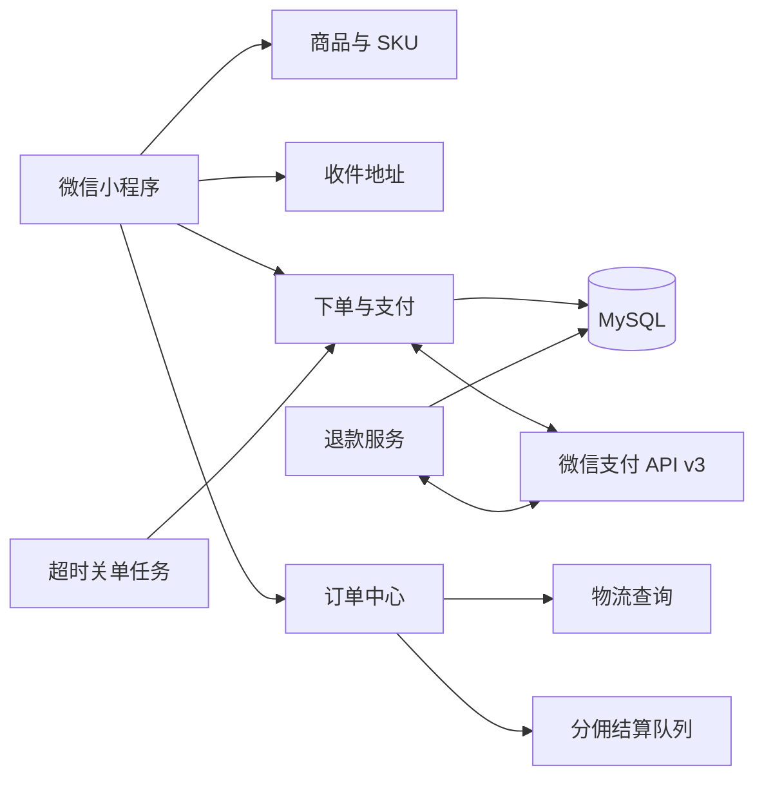
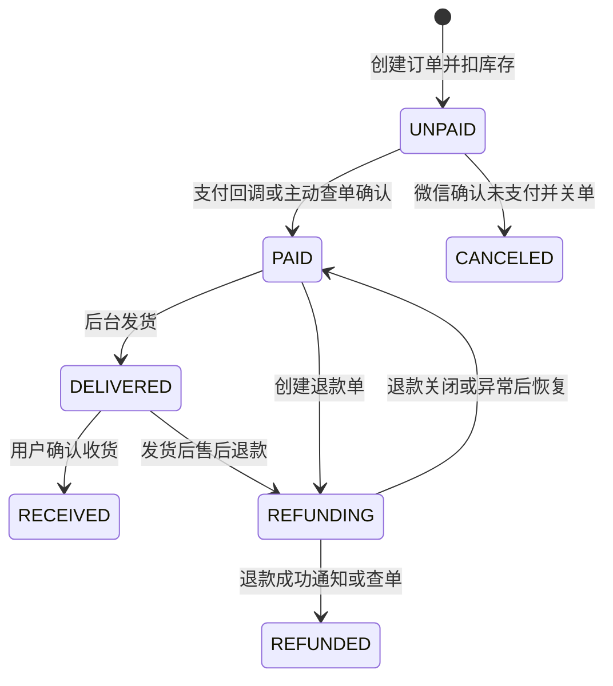
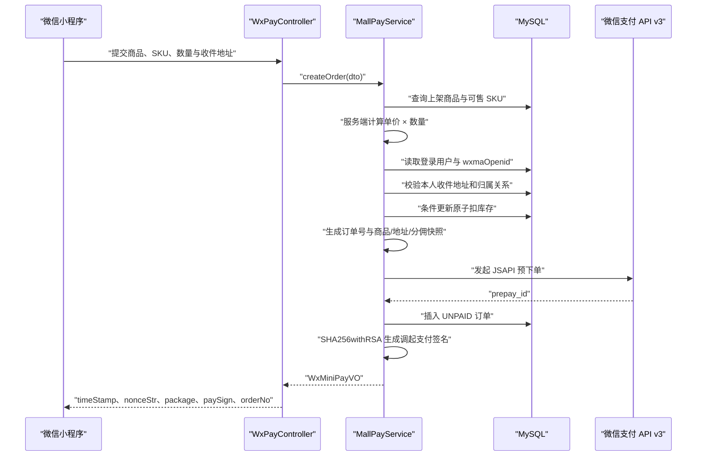
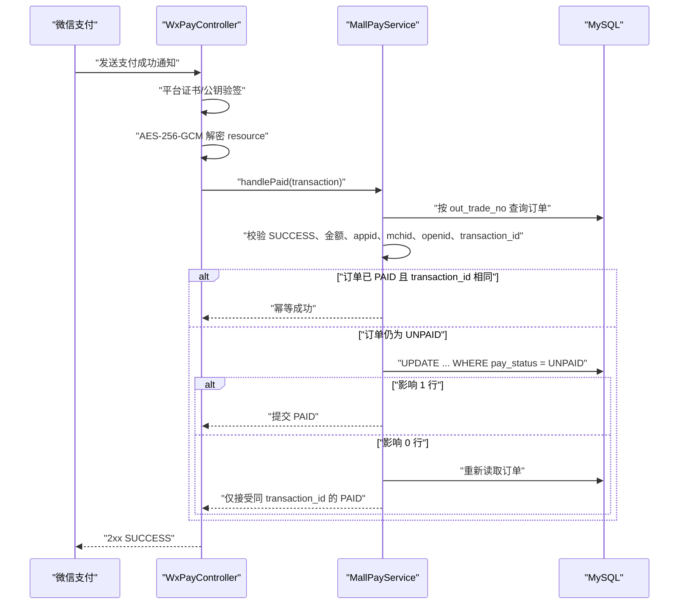
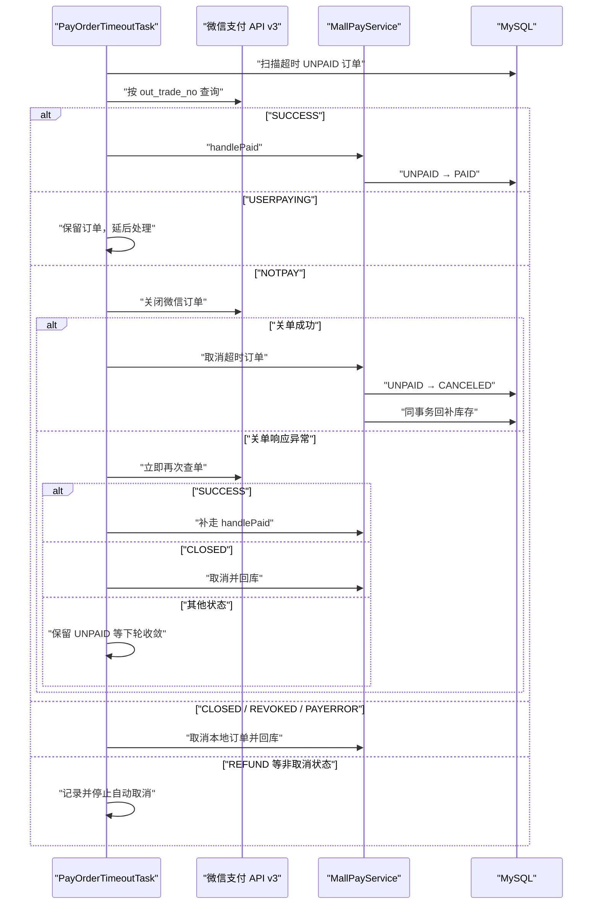
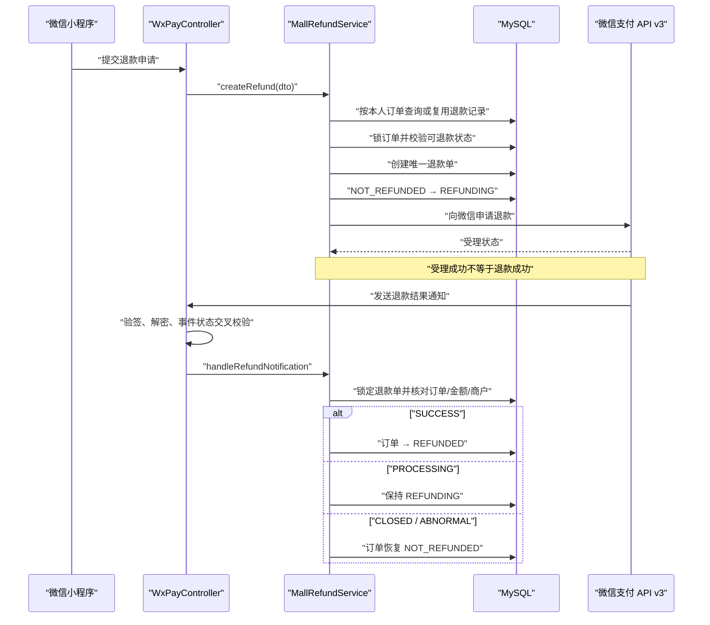
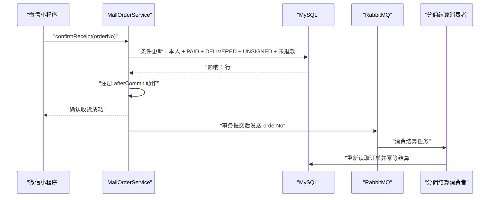

# 商城系统设计与实现：商品、订单、库存与微信支付全链路


以一套真实 Java 商城代码为基线，完整拆解商品与 SKU、地址快照、原子扣库存、订单状态、微信 JSAPI 支付、回调幂等、超时关单、退款、物流、确认收货与分佣触发。

## 先说结论：商城最难的不是 CRUD，而是跨边界的一致性

一个可以上线的商城，至少同时面对四种状态：本地订单状态、库存状态、微信支付状态和履约状态。它们分布在 MySQL、微信支付和消息队列中，不可能依靠一个数据库事务全部包住。因此，正确的设计目标不是“让所有步骤永远同时成功”，而是做到：

1. **金额、库存、用户归属全部由服务端重新确认**，客户端只表达购买意图；
2. **订单保存商品、SKU、价格和地址快照**，历史订单不受主数据修改影响；
3. **库存使用带条件的原子更新**，在并发下只有真正扣减成功的请求才能继续；
4. **支付成功由微信回调和主动查单共同确认**，小程序前端返回不能作为到账依据；
5. **状态迁移使用条件更新（CAS）实现幂等**，重复回调、定时任务和人工补偿可以安全重放；
6. **超时订单先查微信、必要时关微信订单，再取消本地订单并回补库存**，不能反过来；
7. **退款是独立业务单据**，申请受理不等于退款成功，必须通过回调或查单收敛；
8. **数据库事务之外的动作要可补偿、可对账、可观测**，不能把“调用没有抛异常”当成最终一致。

本文基于 `acteeth_mobilecenter` 中的实际实现进行源码走查，核心入口为 `WxPayController`、`MallPayService`、`PayOrderTimeoutTask`、`MallRefundService`、`MallOrderController`、`MallGoodController` 和地址服务。文章会明确区分“当前代码已经实现的行为”与“进一步演进建议”。微信支付接口事实核对日期为 **2026-08-17**，以微信支付官方的 [JSAPI 下单](https://pay.wechatpay.cn/doc/v3/merchant/4012791897)、[支付成功回调](https://pay.wechatpay.cn/doc/v3/merchant/4012791861)、[商户订单号查单](https://pay.wechatpay.cn/doc/v3/merchant/4012791900)、[关闭订单](https://pay.wechatpay.cn/doc/v3/merchant/4012791839) 和 [申请退款](https://pay.wechatpay.cn/doc/v3/merchant/4012587971) 文档为准。

## 一、先划清模块边界

移动端模块不是一个塞满逻辑的 Controller，而是按业务边界拆成几组入口：

| 边界 | 主要类 | 职责 |
|---|---|---|
| 商品 | `MallGoodController`、商品服务、SKU 服务 | 上架商品分页、详情、SKU 解析、价格与库存读取 |
| 地址 | `MallReceiverAddressController`、地址服务 | 地址增删改查、默认地址、用户归属校验 |
| 下单与支付 | `WxPayController`、`MallPayService` | 创建订单、补支付、支付回调、微信查单、关单 |
| 订单中心 | `MallOrderController`、订单服务 | 我的订单、状态查询、物流查询、确认收货 |
| 超时治理 | `PayOrderTimeoutTask` | 扫描超时未支付订单、微信查单、关单、取消与回库 |
| 退款 | `MallRefundService` | 退款单幂等创建、退款申请、回调、状态收敛 |
| 履约后续 | RabbitMQ 分佣结算队列 | 确认收货事务提交后触发下游结算 |



这个划分最重要的价值，是让“用户可调用的接口”“支付领域动作”和“后台收敛任务”各自负责一类问题。Controller 只完成参数接收和协议应答，金额计算、状态机、幂等与事务都在服务层完成。

## 二、核心领域模型：主数据、交易快照与状态机

### 1. SPU 与 SKU 各自负责什么

`MallGoodDO` 表达商品主信息，例如标题、封面、分类、品牌、上下架状态、最低/最高售价和诊所排除名单；`MallGoodSkuDO` 表达可售规格，例如规格编码、规格描述、售价、市场价、分佣比例、总库存、可售库存、销量、规格图片和启用状态。

下单时不能只拿一个 `goodId` 就相信客户端价格。当前实现会：

1. 查询处于上架状态的商品；
2. 根据 `skuId` 查找属于该商品且启用的 SKU；
3. 兼容只有一个可售 SKU 时未传 `skuId` 的旧客户端；
4. 校验 SKU 价格为正、库存足够；
5. 用 `SKU 单价 × 购买数量` 在服务端重新计算总价；
6. 客户端可选传入的总价只用于发现页面价格过期，不作为收款依据。

这条信任边界必须守死：**客户端可以选择 SKU 和数量，但没有定义价格的权力。**

### 2. 为什么订单必须保存快照

订单不是商品表的一个外键视图。当前订单实体保存了：

- 商品 ID、商品标题、商品封面；
- SKU ID、SKU 编码、规格描述、SKU 图片；
- 下单单价、数量、总金额（元）、支付金额（分）；
- 收件人、手机号、地区、地区编码、详细地址；
- 下单时的分佣比例与归属诊所/医生；
- 商户订单号、微信支付订单号、`prepay_id`、支付截止时间；
- 支付、发货、签收、退款等多维状态。

如果订单详情每次都回查最新商品和地址，运营修改标题、用户修改地址、SKU 调价后，历史订单就会“变脸”。交易快照承担的是审计、售后、物流和财务凭证职责，必须在下单时固化。

### 3. 不要用一个 `status` 装下所有状态

当前模型把状态拆成四个正交维度：

| 维度 | 状态 |
|---|---|
| 支付 | `UNPAID`、`PAID`、`CANCELED` |
| 发货 | `UNDELIVERED`、`DELIVERED` |
| 签收 | `UNSIGNED`、`SIGNED` |
| 退款 | `NOT_REFUNDED`、`REFUNDING`、`REFUNDED` |

列表展示时，再由这些底层状态推导用户看到的聚合状态，例如待付款、待发货、待收货、已退款、已取消、退款中、已完成。这样比一个不断膨胀的单字段状态更容易表达并行事实：订单可以“已支付 + 已发货 + 退款中”，而不是被迫创造一个难以维护的组合枚举。



## 三、收件地址：主数据要校验归属，订单要保存快照

地址服务的所有读写都追加 `personId` 条件，避免攻击者枚举地址 ID 读取或修改他人信息。新增第一条地址时自动设为默认；主动设默认时先清除同用户旧默认；删除默认地址后把最近更新的一条剩余地址设为默认。

服务层只复制用户允许编辑的字段：收件人、手机号、地区、地区编码和详细地址。`personId`、默认标记和时间字段由服务端维护，防止 Mass Assignment 覆盖归属字段。

下单时又会按 `receiverAddressId + 当前 personId` 读取地址，并把内容复制进订单。这解决两个不同问题：

- 地址表的归属校验，解决“这是不是你的地址”；
- 订单地址快照，解决“下单那一刻发到哪里”。

生产环境还应给“同一用户最多一个默认地址”增加数据库或并发策略保障。单纯的“先清零、再设一”在同一事务里可以维护常规一致性，但多个并发请求仍可能互相覆盖；可考虑用户维度锁、版本号或可表达条件唯一性的表结构。

## 四、创建订单：一次请求里发生了什么

创建参数 `MallPayCreateDTO` 的核心字段是：`goodId`、可选 `skuId`、大于等于 1 的 `quantity`、可选的页面展示总价、必填 `receiverAddressId`，以及可选的诊所/医生归属信息。

完整调用链如下：



按源码顺序，可以拆成十四步：

1. 根据 `goodId` 查询上架商品；
2. 解析启用的 SKU，并确认它属于该商品；
3. 校验购买数量、SKU 价格和可售库存；
4. 以 SKU 单价乘数量，保留两位小数；
5. 将元转成分并使用整数金额，避免浮点误差；
6. 如客户端传了页面总价，只比较是否与服务端价格一致；
7. 校验可选的诊所、医生和商品排除规则；
8. 从登录态读取 `personId`，查询用户并取得小程序 `openid`；
9. 按地址 ID 和当前用户读取收件地址；
10. 生成全局唯一商户订单号和支付截止时间；
11. 用条件 SQL 原子扣减 SKU 库存；
12. 组装商品、SKU、金额、地址、分佣和初始状态快照；
13. 调用微信支付 JSAPI 下单取得 `prepay_id`；
14. 插入本地订单并生成小程序 `wx.requestPayment` 所需签名参数。

### 金额为什么同时保存“元”和“分”

业务展示使用 `BigDecimal totalPrice`，支付网关使用整数 `totalFee`。转换逻辑等价于：

```java
BigDecimal totalPrice = skuPrice
        .multiply(BigDecimal.valueOf(quantity))
        .setScale(2, RoundingMode.HALF_UP);

// 微信支付金额使用分，intValueExact 防止小数或溢出被静默截断
int totalFee = totalPrice.movePointRight(2).intValueExact();
```

禁止用 `double` 直接计算金额，也不要在回调时再用最新 SKU 价格反推应付金额。回调必须与订单里已经固化的 `totalFee` 对比。

## 五、库存并发：一条 SQL 决定谁真正买到

当前 SKU 扣库存不是“先查询库存，再在 Java 中减一”，而是条件更新：

```sql
UPDATE mall_good_sku
SET stock = stock - :quantity,
    update_time = :updateTime
WHERE id = :skuId
  AND good_id = :goodId
  AND state_flag = '0'
  AND del_flag = '0'
  AND price = :price
  AND brokerage_radio = :brokerageRatio
  AND stock >= :quantity;
```

返回影响行数为 1 才表示扣减成功；为 0 可能是库存不足、SKU 下架、价格变化、分佣比例变化或数据已删除。业务层统一重新读取并返回合适提示。

假设库存只剩 1，两笔请求同时下单：它们都可能先读到 1，但在 InnoDB 对同一行执行更新时，只有第一笔能让条件 `stock >= 1` 成立。第二笔获得锁后会基于最新行重新判断，影响行数为 0，于是不能继续创建订单。这比“select 后 update”少了竞态窗口，也不需要在应用层维护分布式锁。

回补库存同样带边界：

```sql
UPDATE mall_good_sku
SET stock = stock + :quantity,
    update_time = :updateTime
WHERE id = :skuId
  AND good_id = :goodId
  AND del_flag = '0'
  AND stock + :quantity <= total_stock;
```

`stock + quantity <= total_stock` 防止重复回补把库存加穿。更关键的是，回补只在订单从 `UNPAID` 成功迁移到 `CANCELED` 的同一个本地事务内执行；如果支付回调已经把订单改成 `PAID`，取消的条件更新失败，也就不会回库。

## 六、JSAPI 预下单与小程序调起支付

服务端向微信 JSAPI 下单时发送：`appid`、`mchid`、商品描述、商户订单号、支付截止时间、支付通知地址、金额与币种、付款人 `openid`。微信返回 `prepay_id` 后，服务端再生成小程序需要的二次签名。

```java
private WxMiniPayVO buildMiniProgramPayParams(String prepayId, String orderNo) {
    String timeStamp = String.valueOf(System.currentTimeMillis() / 1000);
    String nonceStr = UUID.randomUUID().toString().replace("-", "");
    String packageValue = "prepay_id=" + prepayId;

    // 签名串字段顺序和末尾换行必须与微信支付契约一致
    String message = appId + "\n"
            + timeStamp + "\n"
            + nonceStr + "\n"
            + packageValue + "\n";

    Signature signature = Signature.getInstance("SHA256withRSA");
    signature.initSign(merchantPrivateKey);
    signature.update(message.getBytes(StandardCharsets.UTF_8));
    String paySign = Base64.getEncoder().encodeToString(signature.sign());

    return new WxMiniPayVO(
            timeStamp, nonceStr, packageValue, "RSA", paySign, orderNo);
}
```

小程序拿到参数后调用 `wx.requestPayment`。这里要特别强调：前端 `success` 回调只说明小程序调用结果，不能替代服务端支付通知。前端应跳转结果页并持续查询订单状态，最终以服务端本地订单状态为准；本地状态又只能由经过验签的微信回调或服务端主动查单推进。

## 七、支付回调：先证明“是谁说的”，再处理“说了什么”

支付成功通知的处理顺序是：

1. 读取 `Wechatpay-Serial`、`Wechatpay-Signature`、`Wechatpay-Timestamp`、`Wechatpay-Nonce`；
2. 按 `timestamp + "\n" + nonce + "\n" + body + "\n"` 构造验签串；
3. 用对应微信支付平台证书或公钥验证签名；
4. 只接受 `TRANSACTION.SUCCESS` 事件；
5. 检查 `resource.original_type` 与 `algorithm`；
6. 使用 API v3 密钥、`nonce`、`associated_data` 对 AES-256-GCM 密文解密；
7. 把交易对象交给 `handlePaid`；
8. 本地处理成功后返回成功应答，失败返回非 2xx，让微信按规则重试。

微信官方文档要求先验签再解密，并说明支付通知可能重复发送，因此业务处理必须幂等。当前代码的幂等不是简单“查到已支付就 return”，而是多层校验加条件更新：



### 为什么必须校验这么多字段

- `out_trade_no`：确定本地订单；
- `trade_state=SUCCESS`：避免把处理中或关闭状态当成成功；
- 支付金额：防止错单、配置错误或数据污染造成资损；
- `appid`、`mchid`：确认回调属于当前应用和商户；
- `openid`：确认付款人边界符合订单；
- `transaction_id`：建立本地订单与微信支付订单的唯一映射；
- 当前本地状态：只有 `UNPAID` 才能迁移到 `PAID`。

状态更新使用 `WHERE id = ? AND pay_status = UNPAID`。回调、补支付查单和定时任务即使同时确认成功，也只有一个线程真正完成迁移；其他线程重新读取后看到相同的 `transaction_id`，按幂等成功处理。

## 八、补支付：复用原订单，不重复扣库存

补支付逻辑并不创建新订单。它按 `orderNo + 当前 personId` 查询本人订单，然后：

1. 已支付则拒绝重复支付；
2. 已取消则要求重新下单；
3. 主动查询微信订单；
4. 微信为 `SUCCESS` 时补走 `handlePaid`，让本地状态收敛；
5. `USERPAYING` 时提示稍后查询；
6. `CLOSED`、`REVOKED`、`PAYERROR` 时不允许再拉起；
7. 只有 `NOTPAY` 且仍在支付截止时间之前才继续；
8. 复用原 `prepay_id` 重新生成带新时间戳和随机串的支付参数。

这样做避免“点一次重新支付就再扣一次库存、再生成一张订单”。如果原预支付信息缺失或已经过期，则明确要求重新下单。

## 九、超时关单：先问微信，再决定本地订单和库存

支付系统最危险的竞态之一是：用户刚支付成功，支付回调还在路上，定时任务却把本地订单取消并回补库存。当前任务采用“查单优先 + 关单后二次确认 + 本地 CAS”的策略。

任务默认按固定间隔扫描超时的 `UNPAID` 订单，使用 Redisson 分布式锁避免多实例同时处理同一批任务，并限制每批数量。处理流程如下：



这个顺序体现三个原则：

- **外部支付状态优先于本地超时推断**；
- **不确定时宁可暂留，也不要贸然回库**；
- **最终写本地状态仍要 CAS**，防止查询后到更新前支付回调刚好落库。

微信官方关单接口明确用于未支付且无需继续支付的订单；如果订单已经支付，关单会失败。因此“关单失败后再次查单”不是多余动作，而是填补网络异常与并发时间窗。

## 十、退款：退款申请是另一张状态机

支付成功不意味着退款可以用一条 `order.refunded = true` 完成。当前实现为退款建立独立记录，包含商户退款单号、原交易号、金额、原因、微信退款状态和时间。



### 退款幂等如何实现

- 同一订单先查询已有退款记录，避免每次点击都生成新单；
- 创建退款记录时锁定订单，使用固定、可追踪的商户退款单号；
- 数据库唯一约束兜住并发创建，冲突后读取胜出的记录；
- 微信调用网络超时时把结果视为“未知/处理中”，不能直接标记失败；
- 重试使用同一个商户退款单号，避免重复退款；
- 回调处理锁定退款记录，校验订单号、交易号、金额和商户信息；
- 终态不会被迟到的旧通知回退。

微信官方明确说明：申请退款接口返回成功只代表退款申请已受理，最终结果应通过退款通知或退款查单确认。这正是退款单必须独立建模的原因。

## 十一、订单聚合、物流与确认收货

### 1. 我的订单与状态查询

订单分页始终以当前 `personId` 为条件，按创建时间倒序；再把数据库状态转换成前端聚合状态。支付结果查询同样使用 `orderNo + personId`，不能仅凭可猜测的订单号返回支付信息。

订单 VO 优先使用 SKU 图片，其次才回退到商品封面；标题、规格、价格、地址全部取订单快照，而不是主表最新值。

### 2. 物流查询

物流接口先校验订单归属和运单号，再按物流公司规则准备查询参数。对部分承运商会追加收件手机号后几位以满足查询要求。查询结果进入 Redis 短期缓存，减少同一运单反复请求第三方；第三方异常统一转换为业务错误，不能把供应商响应和密钥暴露给客户端。

缓存键应至少包含承运商编码、运单号以及确有必要的附加参数；缓存失败状态要设置更短 TTL，防止一次临时故障长时间污染结果。

### 3. 确认收货与分佣触发

确认收货不是按 ID 直接更新。当前条件包含：本人订单、已支付、已发货、未签收、未退款。更新成功后才把签收状态改为已签收。

事务提交后，服务只向 RabbitMQ 分佣结算队列发送 `orderNo`，下游可再次读取权威订单数据并执行结算。只发业务 ID 而不是整份可变对象，能降低消息 Schema 耦合。



## 十二、事务边界：哪些能强一致，哪些只能最终一致

### 本地事务内可以保证

- 原子扣库存失败则不创建本地订单；
- 订单从 `UNPAID` 到 `PAID` 的条件更新；
- 订单取消与库存回补同事务；
- 退款单创建与订单进入 `REFUNDING` 同事务；
- 确认收货状态更新本身。

### 数据库事务无法直接保证

- 微信预下单与本地订单插入同时成功；
- 微信回调一定只发送一次；
- 退款 HTTP 超时究竟是失败还是对方已受理；
- 事务提交后销量增量一定执行；
- 事务提交后 RabbitMQ 消息一定投递；
- 物流供应商一定可用。

因此跨边界动作必须使用幂等键、状态机、主动查询、重试、补偿任务、对账和可靠消息，而不是扩大 `@Transactional` 范围。数据库事务开着时调用外部 HTTP 还会延长行锁和连接占用，流量上来后尤其危险。

## 十三、源码走查中值得肯定的设计

1. 价格由服务端 SKU 计算，客户端金额只做一致性提示；
2. 商品、SKU、地址和分佣信息均写入订单快照；
3. 库存扣减、回补都使用带业务条件的原子 SQL；
4. 支付回调先验签、再解密、再执行业务；
5. 支付成功校验金额、商户、应用、付款人和交易号；
6. 支付状态通过 CAS 更新，可承受重复回调和多来源确认；
7. 补支付先主动查微信，不创建新订单、不重复扣库存；
8. 超时任务先查单，关单异常后再次查单，不确定时不回库；
9. 超时任务有分布式锁和批量上限；
10. 退款使用独立单据和固定退款单号，未知结果不贸然失败；
11. 所有用户订单、地址和退款入口都带当前用户归属校验；
12. 确认收货后才触发分佣，且动作安排在事务提交之后。

## 十四、从“可用”走向“抗故障”的改进清单

### 1. 缩短创建订单事务，处理远端孤儿单

当前顺序是：扣库存 → 微信预下单 → 插入本地订单。微信 HTTP 位于数据库事务中；如果微信成功返回而本地插入失败，可能留下远端有单、本地无单的孤儿状态，同时外部调用延长了库存行锁。

更稳妥的演进可以是：

1. 本地事务创建 `CREATING/UNPAID` 订单并扣库存，提交；
2. 事务外调用微信预下单；
3. 成功后回写 `prepay_id` 和 `PAYABLE`；
4. 失败时按错误类型重试或将订单转为创建失败并回库；
5. 用定时任务扫描长时间停留在 `CREATING` 的订单；
6. 商户订单号保持不变，使重试可查询、可幂等。

这不是说当前实现一定错误，而是当流量、故障率和锁等待上升时，事务边界需要进一步拆解。

### 2. 为“创建订单”增加业务幂等键

支付回调已经幂等，但用户双击、客户端超时重试仍可能创建两张不同订单并扣两次库存。可以让客户端生成一次性 `requestId`，服务端按 `personId + requestId` 建唯一约束；同一请求重复到达时返回原订单及可用支付参数。

不要用商品 ID 当幂等键，因为用户合法地可以多次购买同一商品；也不要只依赖前端按钮防抖。

### 3. 用支付截止时间扫描，并建立匹配索引

订单已经保存 `payExpireTime`，定时任务应优先按它扫描，而不是从 `createTime + 固定分钟数` 推算。这样配置变更、个别订单延期和历史数据更清晰。建议索引围绕真实查询设计，例如：

```sql
CREATE INDEX idx_mall_order_pay_expire
ON mall_order (pay_status, pay_expire_time, id);
```

批处理可用稳定的 `(pay_expire_time, id)` 游标推进，避免大偏移分页；索引最终要结合实际表结构和 `EXPLAIN` 验证。

### 4. 修正聚合状态枚举与筛选契约

源码中的聚合状态枚举已经包含“已完成/已收货”编码 6，但分页筛选校验提示、VO 文档和筛选分支仍主要列出 0—5。这个不一致会导致前端展示了已完成状态，却不能可靠按该状态查询。应让枚举成为唯一事实来源，同时更新：

- 参数校验允许值；
- `applyOrderStateFilter` 的 `RECEIVED` 分支；
- VO 字段注释和接口文档；
- 前端筛选项与文案。

### 5. 销量和消息使用 Outbox 保证可恢复

当前支付提交后增销量失败只记录日志，确认收货提交后直接发 RabbitMQ。它们都避免了“事务未提交就执行副作用”，但仍有一个经典窗口：数据库已经提交，进程在执行 after-commit 动作前崩溃。

可以在同一数据库事务内写入 Outbox 事件：

```text
订单状态更新成功
    + INSERT mall_outbox(event_id, aggregate_id, event_type, payload, status)
    + COMMIT

后台发布器读取 NEW 事件
    → 发布 RabbitMQ / 更新销量
    → 标记 SENT
```

消费者再用 `event_id` 或 `orderNo + eventType` 做幂等，便能重试而不重复结算。

### 6. 建立支付与退款对账

回调和定时任务可以解决大多数在线状态，但资损系统还需要日常对账：

- 本地 `PAID`，微信不存在或金额不一致；
- 微信 `SUCCESS`，本地仍 `UNPAID`；
- 本地 `REFUNDED`，微信退款未成功；
- 微信退款成功，本地仍 `REFUNDING`；
- 支付成功订单缺少 `transaction_id`；
- 同一 `transaction_id` 关联多个本地订单。

对账差异先进入可审计的差错表，再由自动规则或人工处理，不要直接批量覆盖生产订单。

### 7. 补齐数据库唯一约束

至少应评估：

- `mall_order.order_no` 唯一；
- 非空 `transaction_id` 唯一；
- `mall_refund.refund_no` 唯一；
- 一单只允许一笔当前业务定义的退款时，`mall_refund.order_id` 唯一；
- Outbox 的 `event_id` 唯一；
- 消费幂等表的业务键唯一。

应用层先查再插不是并发约束，唯一索引才是最后防线。

## 十五、安全设计：交易链路也是越权与资损边界

### 身份与对象归属

- `personId` 从服务端登录态读取，不能接受客户端传入；
- 地址查询必须带 `addressId + personId`；
- 订单、物流、补支付、退款必须带 `orderNo + personId`；
- 医生必须属于所选诊所；
- 商品排除诊所规则必须在下单时重新校验。

### 密钥与回调

- 商户私钥、API v3 密钥不得写入代码仓库或普通日志；
- 回调必须读取原始请求体验签，不能对重序列化后的 JSON 验签；
- 先验签后解密，算法和 `original_type` 都要校验；
- 验签失败、金额不符和商户不符应告警，但日志需脱敏；
- 回调 URL 应仅通过 HTTPS 暴露，并限制请求体大小和读取超时。

### 敏感数据

订单地址快照包含姓名、手机号和详细地址。列表接口只返回页面需要的字段；日志、Trace、告警和消息体不要记录完整手机号、地址、`openid`、密文或密钥。生产数据导出应有权限、审计和有效期。

## 十六、可观测性：看到每次状态迁移为什么发生

建议所有日志和 Trace 带上：`orderNo`、`transactionId`、`refundNo`、脱敏 `personId`、`traceId`、旧状态、新状态、触发来源和影响行数。

重点指标包括：

| 指标 | 说明 |
|---|---|
| 创建订单成功率与 P95/P99 | 区分数据库、微信预下单和签名耗时 |
| 库存扣减失败率 | 按 SKU 观察缺货、下架、价格漂移 |
| 支付回调验签失败数 | 排查错误配置、探测和攻击流量 |
| 回调重复率 | 验证幂等压力和应答时延 |
| `UNPAID → PAID` CAS 冲突数 | 观察回调、查单与任务并发 |
| 超时订单积压与处理年龄 | 防止任务失效导致库存长期占用 |
| 关单失败后二次查单分布 | 识别网络和支付状态竞态 |
| 退款长时间 `PROCESSING` 数 | 驱动主动查单和人工处理 |
| Outbox 未发送数量与最老年龄 | 发现消息发布链路中断 |
| 对账差异金额与笔数 | 直接反映潜在资损 |

日志要记录“事实”，例如 `expectedStatus=UNPAID, affectedRows=0`，而不是只写“支付处理失败”。后者无法判断是重复回调、状态冲突还是数据库异常。

## 十七、常见追问

### 为什么下单时扣库存，而不是支付成功后扣

下单扣库存可以保证用户进入支付页后商品仍为其预留，避免支付成功却无货；代价是必须有超时关单和可靠回补。支付后扣库存减少占用，但高并发时可能出现已付款无货，需要退款或欠货处理。两种模式没有绝对答案，当前实现选择“下单预占库存”。

### Redis 分布式锁能代替库存条件 SQL 吗

不能。锁服务可能超时、续期失败或配置错误，数据库才是库存事实的最终存储。分布式锁适合降低无效竞争或控制定时任务实例，库存正确性仍应由数据库条件更新、事务和约束兜底。

### 收到支付成功回调后能直接把订单改成已支付吗

不能只看事件名称。必须完成验签、解密，并校验金额、商户号、应用、订单号、付款人和交易号，然后用条件更新推进状态。

### 小程序 `wx.requestPayment` 返回失败，需要立即取消订单吗

不需要。用户可能取消，也可能前端返回和服务端状态存在时间差。订单在有效期内保持未支付，允许补支付；到期后由服务端查单和关单任务统一收敛。

### 支付回调和超时任务同时执行会不会把库存加回来

关键取决于本地 CAS。支付只允许 `UNPAID → PAID`，取消只允许 `UNPAID → CANCELED`，同一订单只能有一个更新成功；只有取消更新成功才回补库存。

### 为什么退款失败不能直接把订单改回未退款

HTTP 超时无法证明微信没收到请求。未知结果应保持 `PROCESSING/REFUNDING`，通过原退款单号查单或等待回调确认；只有明确的关闭、异常或失败终态才能按业务规则恢复。

### 为什么确认收货后再分佣

支付后立刻分佣会把退货退款变成复杂的冲正问题。以确认收货作为结算触发点，可以把履约完成作为更稳定的业务事实；即便如此，消费者仍要校验未退款和未结算，并支持冲正。

## 十八、上线前检查清单

### 商品与库存

- 商品、SKU 的上架状态都在服务端校验；
- 价格和分佣比例变化会让旧条件更新失败；
- 扣减和回补 SQL 有边界条件；
- 库存、支付截止时间查询有匹配索引；
- 有超时订单积压告警和人工补偿入口。

### 订单与支付

- 商户订单号全局唯一；
- 创建请求有业务幂等键；
- 金额只用 `BigDecimal` 和整数分；
- 订单保存商品、SKU、价格、地址与归属快照；
- 回调先验签后解密；
- 支付成功校验完整交易字段；
- 状态迁移全部带期望旧状态；
- 前端只查询本地状态，不自行判定到账。

### 超时与退款

- 超时处理先查单，关单异常后再次查单；
- 不确定状态不取消、不回库；
- 退款单号唯一且重试复用；
- 退款受理与退款成功分开；
- 有长时间处理中订单的主动查单任务；
- 有支付、退款账单对账和差错处理流程。

### 履约与消息

- 物流查询校验订单归属并保护敏感信息；
- 确认收货使用条件更新；
- 分佣消费者幂等并重新校验订单；
- 关键 after-commit 动作用 Outbox 或等价可靠机制；
- 消息有重试、死信、积压告警和人工重放能力。

## 总结

这套商城实现的主线很清晰：商品与 SKU 定义可售事实，地址和商品信息在下单时固化为交易快照，条件 SQL 完成库存预占，微信 JSAPI 承担收款，回调与主动查单共同确认支付，CAS 状态迁移承受重复与并发，超时任务负责关单回库，退款单负责异步退款收敛，确认收货再把订单交给分佣链路。

真正决定系统能否长期稳定运行的，不是 Controller 有多少接口，而是每条链路是否回答了五个问题：**权威数据来自哪里、谁有权修改、重复执行会怎样、外部结果未知时怎么办、系统如何最终发现并纠正差异。**

只要金额服务端计算、交易数据快照化、库存原子更新、状态迁移幂等、跨系统动作可补偿、支付退款可对账，商城才从一组 CRUD 接口变成一套可解释、可恢复、可审计的交易系统。
